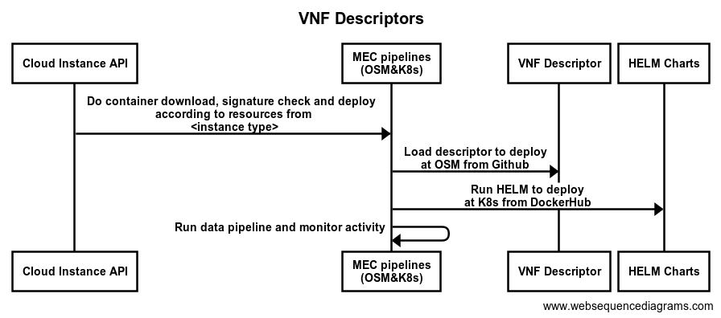

# Overview

This repo includes the VNF descriptors required by OSM:
  - to instantiate data pipelines in a specific MEC triggered by a request from a data consumer

## Usage

[Open Source MANO](https://osm.etsi.org/docs/user-guide/) must be installed to deploy the descriptors.  Please refer to
OSM's [documentation](https://osm.etsi.org/docs/user-guide/03-installing-osm.html) to get started.

Once OSM has been set up correctly, add the repo as follows:

    osm repo-add --type osm --description "5GMETA OSM KNF and NS repository" 5gmeta-osm https://raw.githubusercontent.com/5gmeta/vnfdescriptors/main/descriptors/repository

If you had already added this repo earlier, you can run `osm repo-list` to check the existing repositories.

## Usefull comands:
    
    osm nfpkg-repo-list (list NF packages from OSM repositories)
    osm nfpkg-repo-show --repo 5gmeta-osm cits (shows a specific NF package in a repo)
    osm nfpkg-create --repo 5gmeta-osm cits (onboards a package from a repo into OSM)
    
    osm nspkg-repo-list (list NS packages from OSM repositories)
    osm nspkg-repo-show --repo 5gmeta-osm cits (shows a specific NS package in a repo)
    osm nspkg-create --repo 5gmeta-osm cits (onboards a package from a repo into OSM)

## Adding descriptors to the repository
    
To upload a new descriptor follow the next steps:
- Clone the repository
- Add the source code of the descriptor in [descriptors](https://github.com/5gmeta/vnfdescriptors/tree/main/descriptors) folder
- "osm repo-index --origin descriptors/ --destination repository/"
- Push the changes to the repository

## Authors
- Mikel Serón Esnal ([mseron@vicomtech.org](mailto:mseron@vicomtech.org), [GitHub](https://github.com/mikelseron))
- Felipe Mogollón ([fmogollon@vicomtech.org](mailto:fmogollon@vicomtech.org))

## License

Copyright : Copyright 2022 VICOMTECH

License : EUPL 1.2 ([https://eupl.eu/1.2/en/](https://eupl.eu/1.2/en/))

The European Union Public Licence (EUPL) is a copyleft free/open source software license created on the initiative of and approved by the European Commission in 23 official languages of the European Union.

Licensed under the EUPL License, Version 1.2 (the "License"); you may not use this file except in compliance with the License. You may obtain a copy of the License at [https://eupl.eu/1.2/en/](https://eupl.eu/1.2/en/)

Unless required by applicable law or agreed to in writing, software distributed under the License is distributed on an "AS IS" BASIS, WITHOUT WARRANTIES OR CONDITIONS OF ANY KIND, either express or implied. See the License for the specific language governing permissions and limitations under the License.
